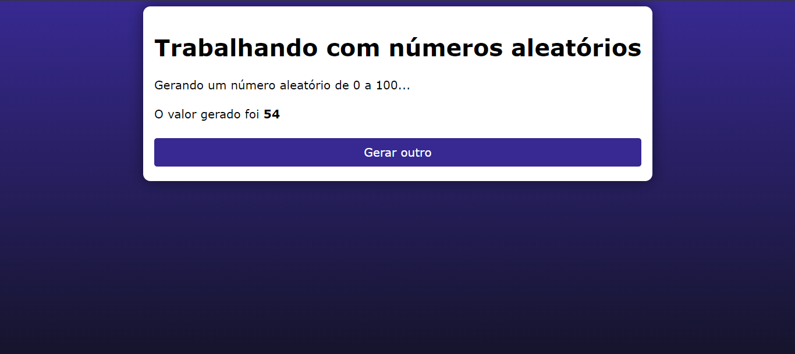

# SORTEADOR DE NUMEROS
👨‍🏫PROJETO CRIADO PARA O CURSO DE PHP.

  

## DESCRIÇÃO:
Esse código representa uma página web que gera um número aleatório entre 0 e 100 e o exibe para o usuário. 

- A página exibe um título indicando que está trabalhando com números aleatórios.
- Ao carregar a página, um número aleatório entre 0 e 100 é gerado.
- Esse número aleatório é então exibido para o usuário.
- O aplicativo fornece um botão "Gerar outro" que permite ao usuário gerar um novo número aleatório, recarregando a página.

## EXECUTANDO O PROJETO:
1. **Executando o Aplicativo:**
   - Coloque os arquivos em um servidor web compatível com PHP (por exemplo, XAMPP, WAMP, LAMP).
   - Acesse o formulário no navegador visitando `http://localhost/CODIGO/index.php`.

2. **Interagir com o Projeto:**
   1. Ao carregar a página, um número aleatório entre 0 e 100 será gerado e exibido.
   2. Se desejar gerar outro número aleatório, clique no botão "Gerar outro".
   3. A página será recarregada e um novo número aleatório será gerado e exibido.
   
## CREDITOS:
- [PROJETO CRIADO PARA O CURSO DE PHP](https://github.com/VILHALVA/CURSO-DE-PHP)
- [PROJETO FEITO PELO VILHALVA](https://github.com/VILHALVA)

